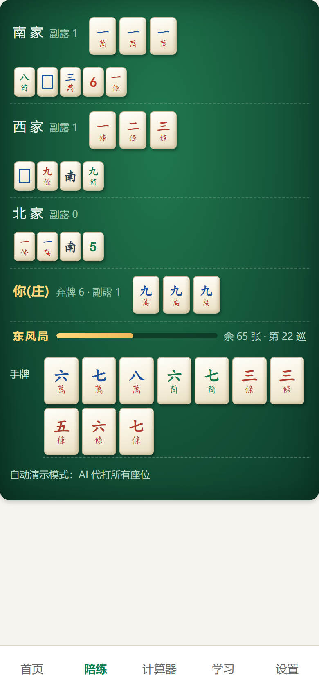
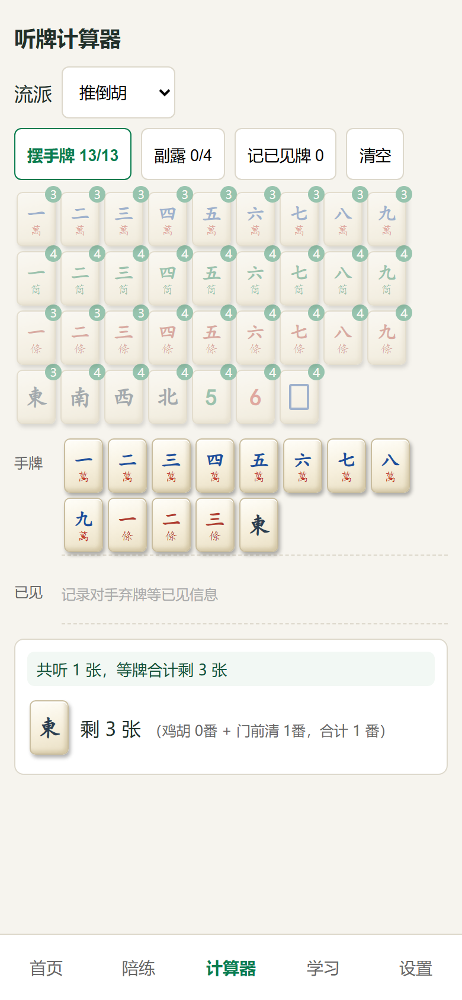
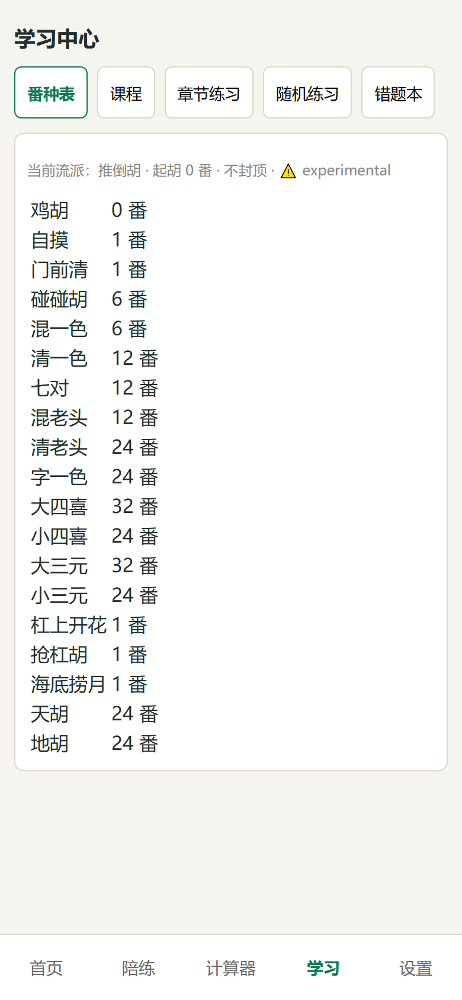
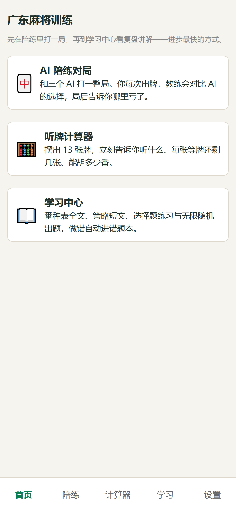
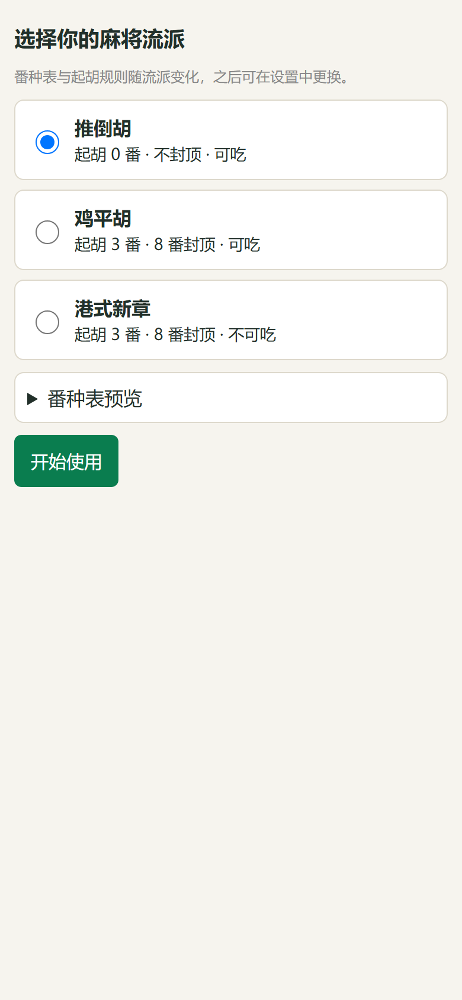

<div align="center">


# 广东麻将训练 · GD Mahjong Trainer

**AI 陪练对局 · 听牌计算器 · 学习中心 —— 三合一的广东麻将训练器**

[](https://github.com/WYHCIPUC/gd-mahjong-trainer/actions/workflows/ci.yml)


[**📱 在线使用 →**](https://wyhcipuc.github.io/gd-mahjong-trainer/) · 手机浏览器打开即玩，「添加到主屏幕」可类原生运行

<table>
  <tr>
    <td width="33%" align="center"><br><sub><b>AI 陪练对局</b>：仿真牌面 + 教练提示</sub></td>
    <td width="33%" align="center"><br><sub><b>听牌计算器</b>：听牌 / 进张 / 番数</sub></td>
    <td width="33%" align="center"><br><sub><b>学习中心</b>：番种表 · 课程 · 题库</sub></td>
  </tr>
  <tr>
    <td colspan="3" align="center">
      &nbsp;
      
      <br><sub>首页导航 · 首启三选一流派引导（推倒胡 / 鸡平胡 / 港式新章）</sub>
    </td>
  </tr>
</table>

</div>

---

## ✨ 为什么做这个

市面上的麻将 App 多是娱乐对战，想**系统提高水平**却缺少工具：没人告诉你这手牌该打哪张、为什么亏了。这个项目把「实战陪练 + 复盘讲解 + 规则学习」放进一个网页里：

- 🤖 **可解释 AI 陪练**：确定性启发式决策器，AI 每次出牌都带理由；你出牌后，教练会对比 AI 的选择，分歧大了局后复盘告诉你哪里亏了。三档难度（新手 / 进阶 / 老手），防守型与进攻型打法权重不同。
- 🧮 **听牌计算器**：摆 13 张牌，瞬间给出听什么、每张等牌还剩几张、能胡多少番；支持副露模式与「记已见牌」余牌推断，均值 < 50ms。
- 📚 **学习中心**：番种表全文、策略短文、章节练习、无限随机出题，做错自动进错题本。
- 🀄 **三种流派**：推倒胡 / 鸡平胡 / 港式新章，规则引擎为纯数据 ruleset，番种表在设置页与学习中心均有全文展示。
- 🔒 **数据不出本机**：纯静态托管，无服务器、无账号、无埋点；对局与进度存在浏览器 IndexedDB，支持一键导出 / 导入 JSON。
- 📴 **离线可用**：PWA（Service Worker 预缓存），装到主屏幕后断网也能打。
- ♻️ **可复现**：一切牌墙洗牌走可播种 RNG（mulberry32），配合自动演示模式（`/play?auto=1&seed=42`）可精确复现一整局。

## 🚀 快速开始

**只想打牌**：手机或电脑浏览器打开 **[wyhcipuc.github.io/gd-mahjong-trainer](https://wyhcipuc.github.io/gd-mahjong-trainer/)** 即可，无需安装注册。

**本地开发**（Node 20+）：

```bash
git clone https://github.com/WYHCIPUC/gd-mahjong-trainer.git
cd gd-mahjong-trainer
npm install            # 国内网络：追加 --registry=https://registry.npmmirror.com

npm run dev            # 开发服务器
npm test               # 快速单元套件（132 用例）
npm run e2e            # Playwright 7 条（需先 npm run build）
npm run build && npm run preview
npm run lint && npx tsc --noEmit
npm run test:sim       # AI vs AI 千局模拟（约 1.5–2 小时，不变量校验）
npm run calibrate      # 教练阈值校准（novice/expert 分歧统计）
```

## 🏗️ 架构

四层结构，分层纪律由 ESLint 强制（领域层零框架零存储依赖；UI/应用层只经 `src/data/repository` 接口访问存储，唯一组装点是 `src/app/store.ts`）：

```
src/ui      React 页面与组件（移动优先，触控目标 ≥ 44px）
src/app     对局控制器 / 教练服务 / 计算服务 / 存储入口
src/domain  纯 TS 领域层：规则引擎、向听数算法、AI 决策、题库
src/data    Repository 接口 + 内存 / IndexedDB 实现
```

## ✅ 测试与质量

| 层面 | 手段 |
|------|------|
| 单元测试 | Vitest 132 用例：胡牌判定、番数计算（每番种 ≥ 2 用例）、向听数已知答案集（0–3 向听边界、七对、十三幺）、题库质量 |
| E2E | Playwright：完整对局演示 + 结算复盘、刷新恢复快照、计算器、学习中心、设置导入导出 |
| 千局模拟 | AI vs AI 1000 局（seed 100–1099，三流派轮换）：牌数守恒不变量全程成立、无异常、单决策均值 < 20ms / p99 < 500ms |
| CI | GitHub Actions：lint + 单测 + build + E2E + Pages 部署全自动；千局模拟独立 job 不阻塞部署 |

详细验收走查见 [docs/acceptance-2026-08-28.md](docs/acceptance-2026-08-28.md)。

## 📌 项目状态（v0.1.0）

- ✅ 已上线 GitHub Pages，核心功能可用
- ⚠️ **番种表数值、教练阈值、结算规则为 experimental 初值**，待对照家规/公开牌例人工核对（[人工待办](docs/acceptance-2026-08-28.md#人工待办发布门槛)）
- 🔜 题库扩充（当前手工精做 12 道，随机练习可无限出题）、真机全面验收

## 🗂️ 约定（给贡献者）

- 牌 ID：`m1..m9`（万）`p1..p9`（筒）`s1..s9`（条）`z1..z7`（字）；计算密集处用 34 维计数向量
- 对局快照 `{ v: 1, ... }` append-only，刷新后从快照恢复
- 番种表为 `src/domain/rulesets/*.json` 纯数据；题库 `src/domain/quiz/bank.json` 由引擎机械验证答案排序（`tests/domain/quiz/bank-quality.test.ts`）
- 界面截图可用 `node scripts/screenshots.mjs`（需先 `npm run build`）重新生成到 `docs/screenshots/`
